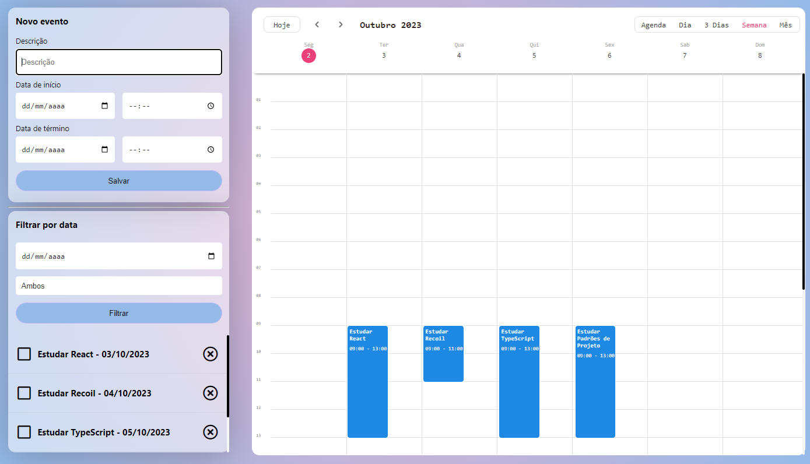

# Event-Tracker

O Event Tracker é um site com a finalidade de disponibilizar um calendario para ajudar a coordenar e organizar as tarefas do usuário, por exemplo, os conteudos a serem estudados estudados.



## 🔨 Funcionalidades do projeto

O Event Tracker é um projeto que melhorado no decorrer do curso de gerenciamento de estado com Recoil. Durante o curso foi feito a refatoração de código e a criação de hooks personalizados para resolver o problema de Prop Drilling, um problema que é recorrente quando se desenvolve aplicações React utilizando props para passar para os componentes informações. Além disso, foi utilizado a biblioteca json-server para simular uma API-Rest, fazendo que os eventos fossem listados de forma dinamica, em vez de ser algo fixo no código.

O que faz esse problema ser tão difícil de ser solucionado é que conforme o projeto vai crescendo, mais props são criadas, fazendo que em pouco tempo se torne muito difícil indentificar onde os dados são inicializados, onde são atualizados e onde são utilizados. Existem algumas alternativas como o **Context API**, nesse projeto foi utilizado a biblioteca **Recoil**.

## ✔️ Técnicas e tecnologias utilizadas

Se liga nessa lista de tudo que usaremos nesse treinamento:

- `React`
- `React Hooks`
- `TypeScript`
- `recoil`
- `json-server`

## 🛠️ Abrir e rodar o projeto

Para abrir e rodar o projeto, execute ```npm i``` para instalar as dependências e ```npm start``` para inicar o projeto. Lembre de separar o projeto e a API antes de iniciar o projeto.

Depois, acesse <a href="http://localhost:3000/">http://localhost:3000/</a> no seu navegador.

Para inicializar o json-server, caso ainda não tenha instalado no seu dispositivo digite no terminal ```npm install -g json-server```, após instalar o pacote execute o comando ```json-server --watch db.json -p 8080```, como está sendo utilizado pelo react a porta 3000, estamos alterando a porta do json-server com a flag -p para 8080.
